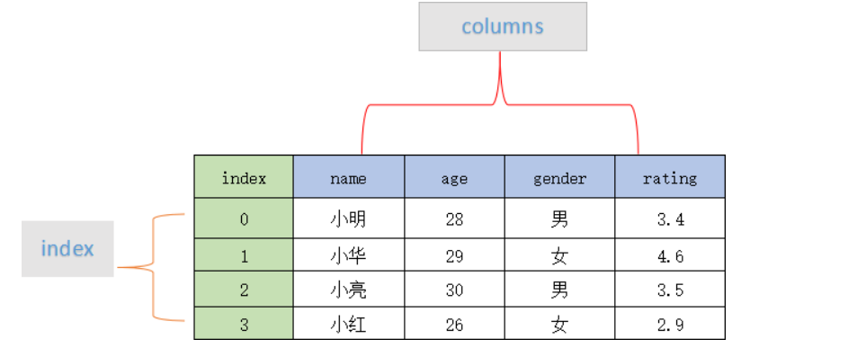
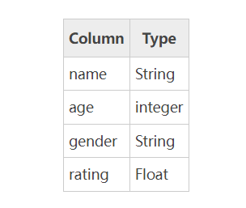
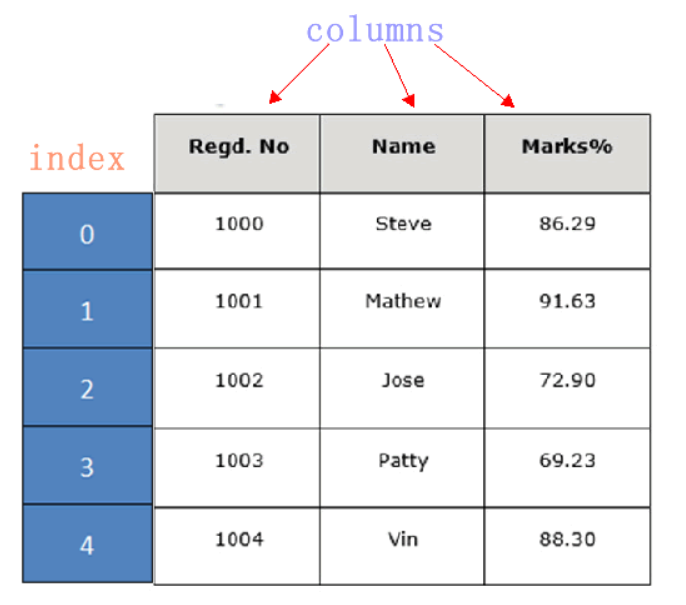

DataFrame 一个表格型的数据结构，既有行标签（index），又有列标签（columns），它也被称异构数据表，所谓异构，指的是表格中每列的数据类型可以不同，比如可以是字符串、整型或者浮点型等。其结构图示意图，如下所示：

Dataframe结构示意图

表格中展示了某个销售团队个人信息和绩效评级（rating）的相关数据。数据以行和列形式来表示，其中每一列表示一个属性，而每一行表示一个条目的信息。

下表展示了上述表格中每一列标签所描述数据的数据类型，如下所示：

DataFrame 的每一行数据都可以看成一个 Series 结构，只不过，DataFrame 为这些行中每个数据值增加了一个列标签。因此 DataFrame 其实是从 Series 的基础上演变而来。在数据分析任务中 DataFrame 的应用非常广泛，因为它描述数据的更为清晰、直观。

通过示例对  DataFrame 结构做进一步讲解。 下面展示了一张学生成绩表，如下所示：

pandas dataframe结构

DataFrame 结构类似于 Execl 的表格型，表格中列标签的含义如下所示：
Regd.No：表示登记的序列号
Name：学生姓名
Marks：学生分数

同 Series 一样，DataFrame 自带行标签索引，默认为“隐式索引”即从 0 开始依次递增，行标签与 DataFrame 中的数据项一一对应。上述表格的行标签从 0 到 5，共记录了 5 条数据（图中将行标签省略）。当然你也可以用“显式索引”的方式来设置行标签。

下面对 DataFrame 数据结构的特点做简单地总结，如下所示：
DataFrame 每一列的标签值允许使用不同的数据类型；
DataFrame 是表格型的数据结构，具有行和列；
DataFrame 中的每个数据值都可以被修改。
DataFrame 结构的行数、列数允许增加或者删除；
DataFrame 有两个方向的标签轴，分别是行标签和列标签；
DataFrame 可以对行和列执行算术运算。
